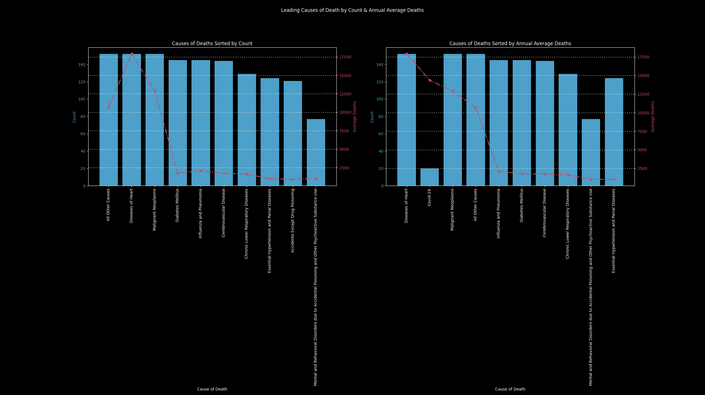
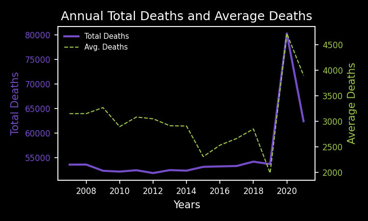
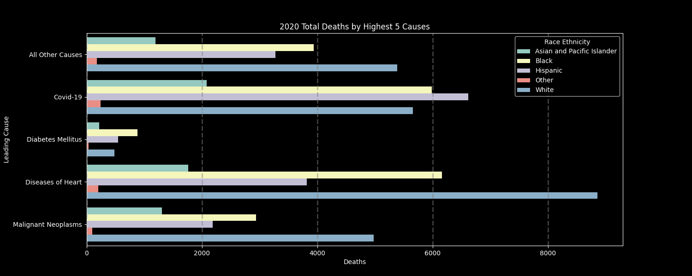
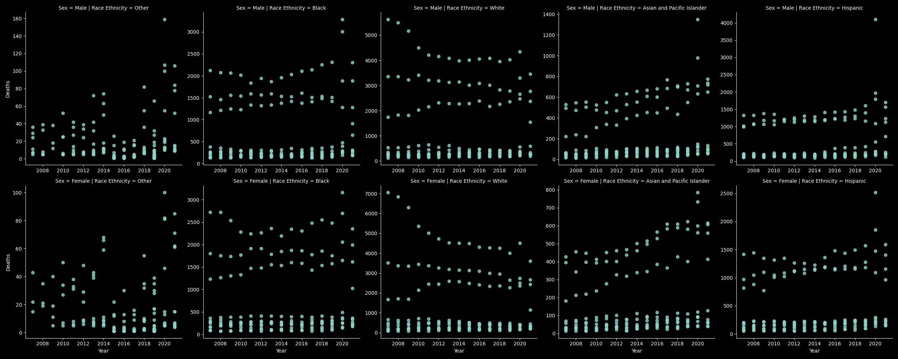
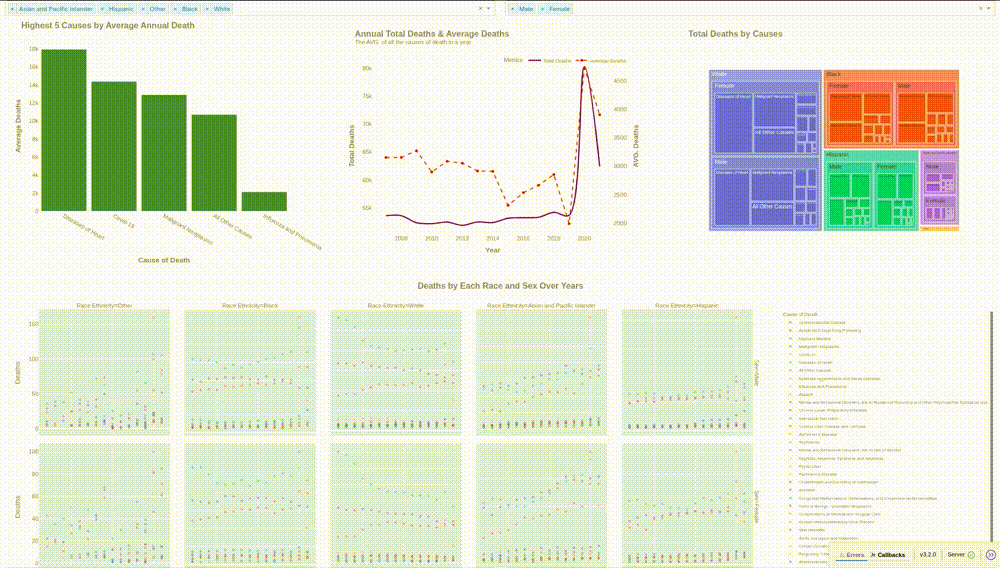

# New York City Leading Causes of Death — EDA & Dashboard Project

This project presents an Exploratory Data Analysis (EDA) and an interactive dashboard exploring the leading causes of death in New York City (2007–2021).
Data is sourced from the official [NYC Open Data Portal](https://opendata.cityofnewyork.us/)
.
## Overview:

The leading causes of death by sex and ethnicity in New York City in since 2007. Cause of death is derived from the NYC death certificate which is issued for every death that occurs in New York City.

Rates based on small numbers (RSE > 30) as well as aggregate counts less than 5 have been suppressed in downloaded data

Source: [Bureau of Vital Statistics and New York City Department of Health and Mental Hygiene](https://data.cityofnewyork.us/Health/New-York-City-Leading-Causes-of-Death/jb7j-dtam/about_data)

## Results:

1. Top Causes:
- Diseases of Heart and Malignant Neoplasms are the most frequent and deadly causes, with annual averages of ~17.5k and ~12.5k deaths respectively.
- COVID-19 became a major cause only in 2020 due to the dataset’s time range (2007–2021).



2. Annual Trends: 
- From 2007–2019, total deaths hovered around 55,000 per year.
- In 2020, deaths spiked to ~80,000, driven mainly by Diseases of Heart and COVID-19.

<p align="center">
  
  
</p>

3. The first chart in the below figure represents the distribution of death by each cause on both genders over the years, the second shows the total deaths over the years.


4. Next figure is a summary of the total death over the years and each chart represent the gender and its race, and each point represent a cause of death 



## To View JupyterLab File:
- install uv
```bash
pip install uv
```
- initialize and install dependencies
```bash
uv sync
```
- activate virtual environment
```bash
source .venv/bin.activate
```
- launch jupyterlab
```bash
jupyter lab
```

## To View Dashboard:
- [after installing uv and installing dependencies](##ToViewJupyterLabFile), navigate to the dashboard directory:
```bash
cd dashboard
```
- run main.py which contain the dashboard:
```bash 
uv run main.py 
```

## Tools:
- jupyterlab
- matplotlib
- pandas
- seaborn
- dash 
- dash-bootstrap-components
- duckdb
- plotly

## Process: 
### Data Cleaning:
1. Dropping unnecessary columns for analysis 
2. Checking for missing values
3. Changing data type and formatting some values and clean it 
4. Removing duplicated rows 
### Data Exploration:
1. Getting summary statistics
2. Manipulating data and making charts to visualize the result 
3. Finding pattern in data 
### Dashboard Building:
1. Structured directory into main file, filters and components packages
3. Visualized the EDA result in an interactive dashboard 



